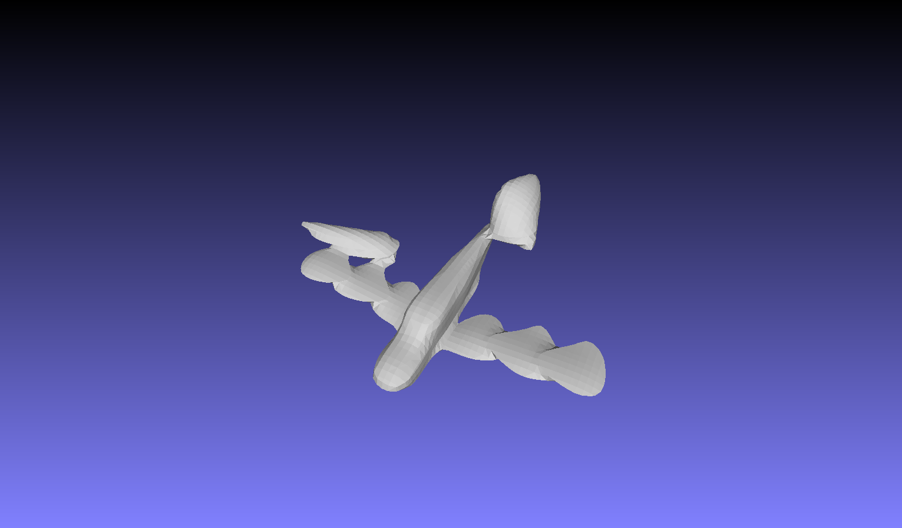
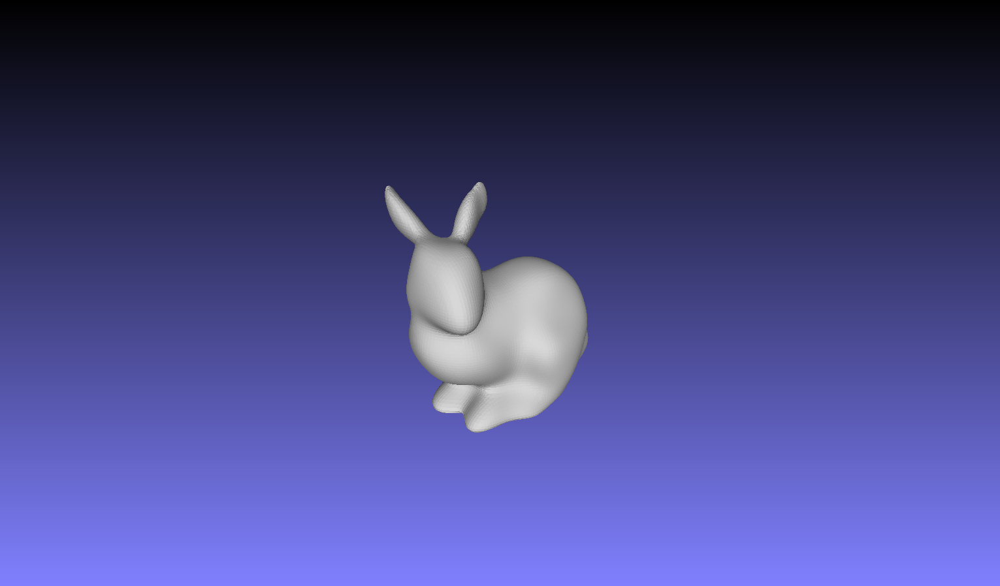
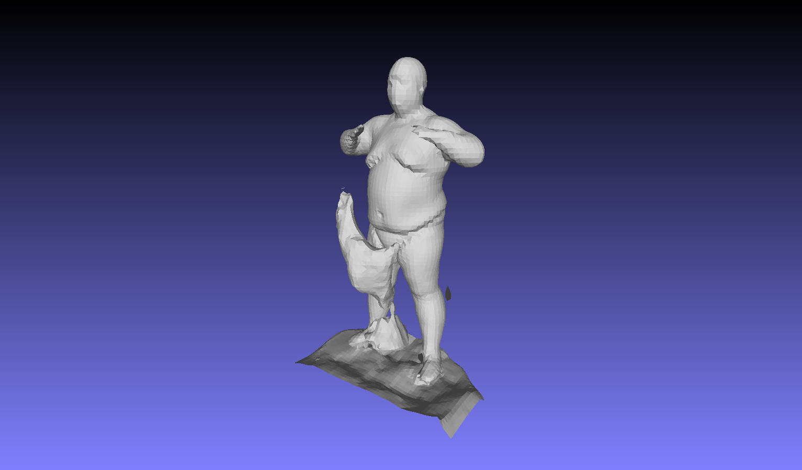

Pytorch Implementation of Implicit Gemoteric Regularization.Based on the paper:

  > [Implicit Geometric Regularization for Learning Shapes](https://arxiv.org/abs/2002.10099)\
  > Amos Gropp, Lior Yariv, Niv Haim, Matan Atzmon, Yaron Lipman\
  > arXiv:2002.10099

### To-Do
- [ ] Finish the shape space experiments for Shapenet.
- [ ] Remove extra artifacts from final output mesh. 
- [ ] Add semantic branch for mesh rendering step for semi supervised SSC.

### Sample results on DFAUST and Shapenet
#

#

#

